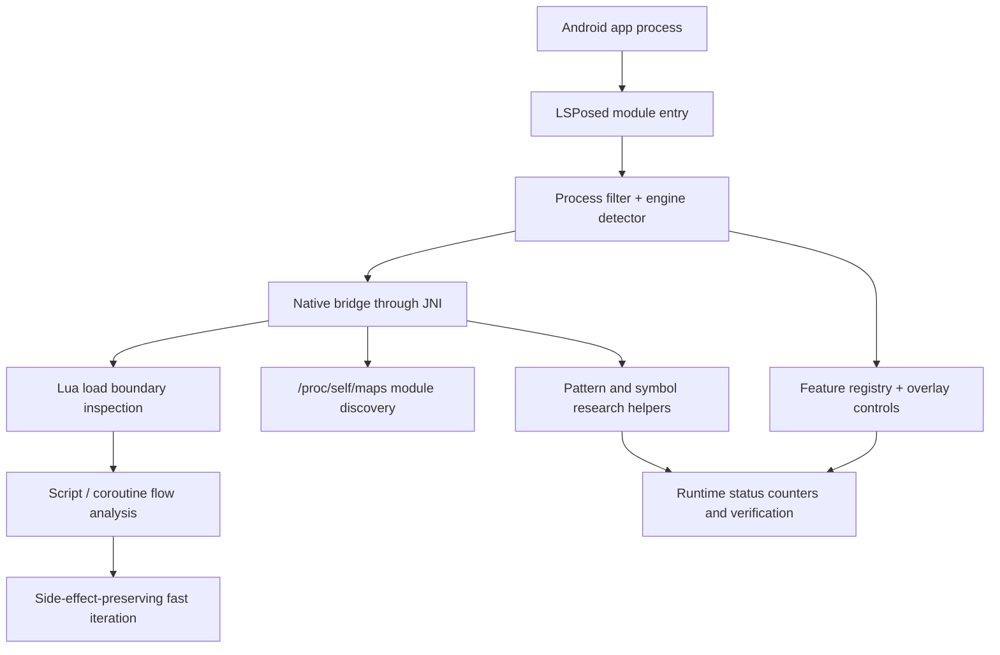

# ae-pcd-stamp-tracer — Public Case Study

Public engineering write-up for `ae-pcd-stamp-tracer`, a private Android runtime-instrumentation
project. The private repository is target-specific; this case study focuses on the architecture,
the systems problems, and the engineering decisions, which are the parts that generalize.

## System Architecture

## What This Project Demonstrates

| Area | Engineering |
| --- | --- |
| Module architecture | LSPosed entry points, process scoping, Java ⇄ C++ bridge, Gradle / CMake / NDK build. |
| Engine classification | Runtime detection for Unity, Unreal, Cocos2d-x, Godot, Flutter, React Native, Xamarin, and native-heavy apps via `nativeLibraryDir` + `/proc/self/maps`. |
| Native discovery | `/proc/self/maps` module lookup, target library range discovery, symbol/pattern research, verifier logs. |
| Lua runtime hooks | Load-boundary interception (`luaL_loadbuffer`) so decoded Lua chunks and script names can be observed without altering the script that runs. |
| Feature control | Runtime feature registry, overlay controls, persisted settings, native status counters, fail-closed behavior. |
| Simulation iteration | Fast-iteration design that shortens waits while still stepping through every script line that mutates flags, rewards, inventory, achievements, saves, or scene state. |
| AI-game relevance | State-extraction and runtime-verification patterns that support agent evaluation, automated testing, and fast simulation loops. |

## Engineering Highlights

- Built an engine-neutral Android runtime scaffold (the universal template) and then specialized it
  for a native-heavy Cocos2d-x / Lua runtime.
- Used library-load and script-load boundaries as stable observation points when no public API
  exists. Boundaries are durable across game updates in ways that fixed RVAs are not.
- Treated runtime patching as a **verification problem**: every feature gets a toggle, a status
  counter, logs, and a safe disabled state. A hook that silently no-ops is worse than no hook.
- Mapped script-level concepts (dialogue, wait helpers, choices, coroutine yields) back to native
  runtime behavior so the same feature can be expressed either in script or in native, depending on
  which layer is more stable.
- Designed fast-iteration around correctness: collapse waits, but never skip a script step that
  fires side effects. Naive skips invalidate the resulting state.

## Why It Is Relevant

Game-oriented AI research often needs infrastructure below normal editor scripting:

- state extraction from real game / runtime environments
- repeatable automation across device and emulator setups
- controlled simulation speed-ups
- verification that side effects still occur in the intended order
- instrumentation that works in native-heavy Android apps

`ae-pcd-stamp-tracer` is the project where I explored those problems most deeply.

## Concrete Problems Studied

### Engine Routing

Different Android games expose very different runtime surfaces. Unity IL2CPP work starts from
`libil2cpp.so`, metadata, method pointers, and managed field layouts. Cocos2d-x / Lua work starts
from script loading, Lua C bindings, coroutine yields, and native UI dispatch.

The project is built around detecting that runtime shape first and choosing the correct research
strategy, instead of forcing every game through the same hook model.

### Dialogue and Coroutine Timing

A common simulation problem: how to accelerate a long interactive sequence without invalidating the
state it produces. A naive skip can jump past rewards, flags, saves, or scene transitions. The
safer design is **fast iteration**: collapse waits, but still step through the script so every
side-effecting line fires in order.

For AI agents this matters because faster simulation is only useful when the environment state
remains truthful.

### Runtime Verification

The private project tracks behavior through logs, counters, and status files rather than visual
guesses. The same verification style is what AI evaluation pipelines need: an agent run depends on
observed state, not on a screen recording.

## Public Companion Repositories

- Android game runtime portfolio index: https://github.com/Jordan231111/android-game-runtime-portfolio
- ARM64 Houdini framework: https://github.com/Jordan231111/arm64-houdini-lsposed-framework
- Universal LSPosed template: https://github.com/Jordan231111/lsposed-universal-template

Live walk-through of the private repository available on request.
