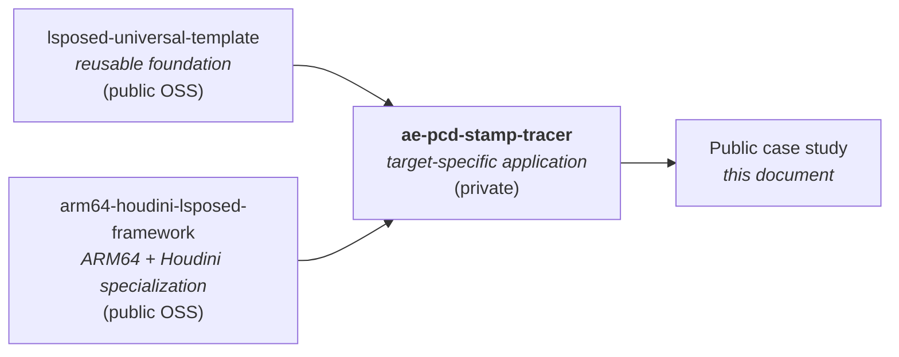
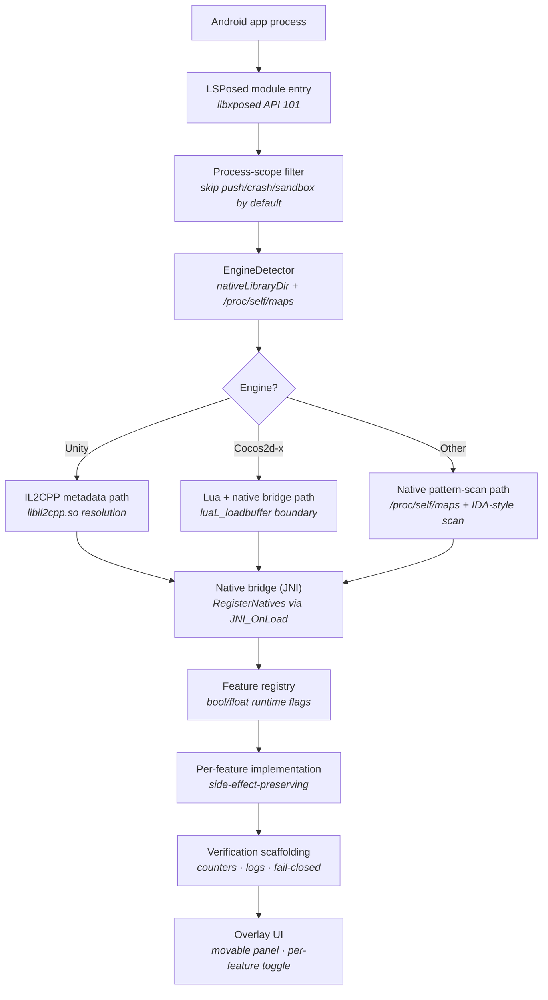

# ae-pcd-stamp-tracer — Public Case Study

**Engine-neutral Android runtime instrumentation for native-heavy games — built on a reusable ARM64/LSPosed foundation. Five years of incremental research, ~10K+ LOC, verification-first design.**

  
  
  
  

> The private repository is target-specific and is not published as raw code. This document covers
> the architecture, design decisions, and the specific engineering problems that were solved —
> the parts that generalize, and the parts that recruiters and engineers tend to care about.

---

## TL;DR

`ae-pcd-stamp-tracer` is the **applied** layer of a three-tier engineering trajectory: a
reusable LSPosed foundation, an ARM64 / Houdini specialization, and a target-specific application
against a Cocos2d-x / Lua native-heavy Android runtime. The foundations are public OSS; the
application is private; this case study explains the engineering between them.

The center of the work is **verification-first runtime patching**: every feature ships with a
toggle, a status counter, a log line, and a safe disabled state. A hook that silently no-ops is
worse than no hook.

---

## Project Lineage

Each tier owns a clear responsibility. The reusable parts are open so others can build on them;
the application-specific layer that proves they work at scale is private; the engineering
between them is documented publicly here.

---

## Scope

| Metric | Value |
| --- | --- |
| Active research | 5 years of incremental work |
| Approximate code base | ~10K+ LOC |
| Languages in active use | C++ (native hooks), Java (LSPosed entry, overlay, JNI), Lua (script-side analysis), Python (tooling) |
| Major architecture iterations | Three (current design is the third refactor) |
| Primary engine covered | Cocos2d-x / Lua, with engine-neutral hooks that generalize to others |
| Test surface | Real devices + Houdini-translated x86_64 emulators |

---

## System Architecture

---

## Key Technical Problems Solved

### 1. Engine routing without source access

**Problem.** An Android game ships as a stripped APK. There's no manifest tag telling you which
engine it uses, and engine choices change the entire research strategy: Unity work starts from
IL2CPP metadata; Cocos2d-x / Lua work starts from script loading; Unreal work starts from
`BP_UObject` traversal. Picking the wrong starting point wastes weeks.

**Solution.** Library-name classification, fast path first. Scan `nativeLibraryDir` (cheap, no
`/proc` IO) and check for engine-signature `.so` names (`libil2cpp.so` → Unity, `libcocos2dcpp.so`
→ Cocos2d-x, `libUE4.so` → Unreal, etc.). Fall back to `/proc/self/maps` when the engine library is
dynamically loaded later in the process lifecycle. Report the matched evidence back through the
overlay so an operator can confirm.

**Why it works.** Engine entry points are extremely stable across game updates — `libil2cpp.so` has
been the Unity IL2CPP runtime library name since IL2CPP shipped. A game can change every other
file in an update and this detector still resolves correctly.

### 2. Stable observation points over fixed RVAs

**Problem.** The naive approach to game-runtime hooking is to dump the binary, find the function
you want at offset `0x4A8C2`, and patch that exact address. This breaks on every game update — the
function moves and your patch hits garbage. For a research project that runs over years, fixed-RVA
hooks are unmaintainable.

**Solution.** Hook **boundaries** instead of addresses. `luaL_loadbuffer` for Lua scripts is a
stable C symbol that has lived in the Lua API since Lua 5.1. IL2CPP metadata APIs (`il2cpp_class_from_name`,
`il2cpp_class_get_method_from_name`) are stable across Unity versions. Hooking these gets you
*every* script load or *every* method resolution, regardless of game-version offset drift.

**Trade-off acknowledged.** Boundary hooks are noisier (you see all loads, not just the one you
want) and require runtime filtering. The maintenance cost saved is far greater than the runtime
filtering cost.

### 3. Side-effect-preserving fast iteration

**Problem.** A common simulation goal in this kind of work is to accelerate a long interactive
sequence — dialogues, cutscenes, animations — without invalidating the state it produces. The
naive approach (skip the wait entirely, or skip the whole sequence) jumps past flag mutations,
reward grants, save points, achievement triggers, and inventory updates. The result looks faster
but the game state is wrong.

**Solution.** **Fast iteration, not skipping.** Collapse the wait duration to ~0 but still step
through every script line and coroutine yield. Every side effect fires in the intended order,
just at machine speed instead of human speed.

**Why this matters for AI work.** AI agents trained or evaluated against runtime environments need
faster simulation *only if* the resulting state is truthful. A 100× faster simulation that
silently desyncs from ground truth is worse than no simulation.

### 4. Houdini / native-bridge alias-aware patching

**Problem.** On x86_64 Android emulators with Houdini / native bridge, an `arm64-v8a` library is
loaded as guest ARM64 code and translated for the host. The same file offset can appear at
**multiple mapped addresses simultaneously** — one for the verifier to read, others that gameplay
actually executes through. Patching one alias and reading back the patch returns "verified," but
the game continues running the unpatched alias.

**Solution.** **Alias-aware writes.** Discover every mapping in `/proc/self/maps` that backs the
same file offset for the same `.so`, then patch all of them in one transaction. Verify after each
write. The hooking layer treats "the patch" as a set, not a single address.

**Why this is non-obvious.** Most off-the-shelf inline-hook libraries assume one mapping per file
offset, which is true on real ARM64 devices and false under Houdini. They fail silently in this
environment, which is why the `arm64-houdini-lsposed-framework` ships its own native primitives
instead of depending on them.

### 5. JNI symbol-table stealth via `RegisterNatives`

**Problem.** The default JNI binding pattern — `extern "C" JNICALL Java_com_yourpkg_YourClass_yourMethod(...)`
— writes your method names into the `.so` symbol table. Anyone who runs `nm` or `readelf` on your
native library sees your hook framework's structure laid out in plain text.

**Solution.** Register all native methods via `RegisterNatives` inside `JNI_OnLoad`. The Java side
declares `private static native X foo(...)`; the native side never exports a `Java_*` symbol; the
symbol table contains only library internals and dependencies. Loadability is unaffected.

### 6. Process-level scope filtering

**Problem.** A modern Android app is not one process. It's a main process plus crash-reporter,
push-notification, sandbox, and (sometimes) anti-cheat satellite processes. A hook that runs in
all of them produces logs from contexts you don't care about and increases the chance of crashing
something innocuous.

**Solution.** **Process-suffix allow / deny lists** with safe defaults. The framework's default
skip list covers `:push`, `:crash`, `:sandbox`, `:watchdog`, and known anti-cheat satellite names.
Targets opt in via `TARGET_PROCESS_SUFFIXES`; opt-outs override via `SKIP_PROCESS_SUFFIXES`. The
main process is the default target.

### 7. Fail-closed verification

**Problem.** A hook that installs against an unresolved symbol — wrong address, wrong type — can
silently corrupt unrelated memory. The failure mode is "the game crashes 90 seconds later for no
visible reason." Debugging that is expensive.

**Solution.** **Fail closed.** If metadata resolution returns null, refuse to install the hook,
log the failure with the expected symbol name, and report the failure through the status counter
that the overlay reads. The feature shows as "unavailable" instead of "active but broken."

---

## Engineering Principles

1. **Boundaries over addresses.** Stable C symbol boundaries (`luaL_loadbuffer`, IL2CPP metadata
   APIs, well-known engine entry points) age better than fixed offsets. Maintenance cost over years
   dominates any one-time analysis cost.

2. **Verification is part of the feature.** A hook without a status counter, log line, and safe
   disabled state is not finished. The overlay shows the same data the logs show. The user is never
   guessing whether the hook is doing anything.

3. **Engine-neutral foundations, engine-specific applications.** The reusable parts — pattern
   scanning, page-permission-aware writes, module discovery, feature registry — don't know which
   game they're running against. Engine-specific logic lives in clearly labeled modules that can be
   swapped or extended.

4. **Fail closed, log loud.** Anywhere a misconfiguration could silently produce garbage, the
   system refuses to operate and tells the operator why. Loud failures are cheap to debug; silent
   ones are expensive.

---

## Why Engine-Neutral

Most game-runtime tools are written for one game. They produce one paper or one demo, then rot
because the game updated and nobody maintained the hooks. The choice to build engine-neutral
foundations was deliberate:

- **Reusability.** The same template handles Unity, Cocos2d-x, Unreal, Godot, Flutter, React
  Native, and Xamarin targets — branching only at the engine-specific module layer.
- **Maintenance pays off twice.** A fix in the alias-aware-writes path benefits every target;
  a fix in `EngineDetector` benefits every future target.
- **Easier reasoning.** Concerns are separated by layer: discovery, patching, feature state, UI.
  Bugs are localized.

This is the design philosophy AI research infrastructure benefits from too: the parts that don't
care about the specific environment should be reusable across environments, with the
environment-specific parts isolated and explicitly named.

---

## Public Companion Repositories

| Repository | Role |
| --- | --- |
| **[lsposed-universal-template](https://github.com/Jordan231111/lsposed-universal-template)** | Engine-neutral reusable LSPosed scaffold (foundation) |
| **[arm64-houdini-lsposed-framework](https://github.com/Jordan231111/arm64-houdini-lsposed-framework)** | ARM64 + Houdini specialization (specialization) |
| **[Archero-LSPOSED-Mod](https://github.com/Jordan231111/Archero-LSPOSED-Mod)** | Unity IL2CPP applied example (separate target) |
| **[android-game-runtime-portfolio](https://github.com/Jordan231111/android-game-runtime-portfolio)** | Portfolio index |

---

## Walkthrough Available

The private repository contains target-specific implementation details, so it is not published as
raw code. I am happy to walk through it live or provide selected excerpts when appropriate —
architecture diagrams, specific hook implementations, the engine-detection module, the verification
layer, or any of the seven technical problems above in more depth.

**Contact:** yejordan8888@gmail.com — [LinkedIn](https://www.linkedin.com/in/jordan-ye-100b86237/)
