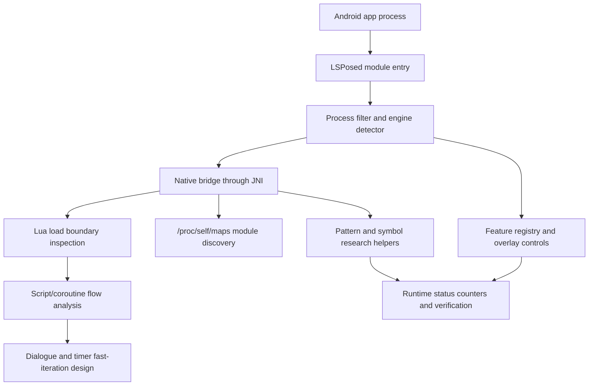

# ae-pcd-stamp-tracer Public Case Study

Public portfolio version of `ae-pcd-stamp-tracer`, my private Android game-runtime instrumentation
research project.

The private repository contains target-specific implementation details, so this public repo focuses
on the architecture, systems problems, and engineering decisions that are relevant to game-runtime,
simulation, and AI research work.

## System Architecture

## What This Project Demonstrates

| Area | Technical Work |
| --- | --- |
| Android module architecture | LSPosed entry points, process scoping, Java/C++ bridge, Gradle/CMake/NDK build system. |
| Engine detection | Runtime classification for Unity, Unreal, Cocos2d-x, Godot, Flutter, React Native, Xamarin, and native-heavy apps. |
| Native discovery | `/proc/self/maps` module lookup, target library range discovery, symbol/pattern research, and verifier logs. |
| Lua runtime analysis | Load-boundary inspection for decoded Lua buffers and script names in a Cocos2d-x/Lua style runtime. |
| Feature control | Runtime feature registry, overlay controls, persisted settings, native status counters, and fail-closed behavior. |
| Simulation iteration | Dialogue/timer fast-iteration design that preserves coroutine side effects instead of skipping script execution. |
| AI-game relevance | State tracing and runtime verification patterns that can support agent evaluation, automated testing, and fast simulation loops. |

## Engineering Highlights

- Built an engine-neutral Android runtime scaffold, then applied it to a native-heavy game runtime.
- Used library-load and script-load boundaries as stable observation points when no public API exists.
- Treated runtime patching as a verification problem: every feature needs a toggle, a status counter,
  logs, and a safe disabled state.
- Mapped script-level concepts such as dialogue, wait helpers, choices, and side effects back to
  native runtime behavior.
- Designed fast-iteration logic around correctness: shorten waits, but preserve every script step
  that mutates flags, rewards, inventory, achievements, saves, or scene state.

## Why It Is Relevant

Game-oriented AI research often needs infrastructure below normal editor scripting:

- state extraction from real game/runtime environments
- repeatable automation across device and emulator setups
- controlled simulation speedups
- verification that side effects still occur in the intended order
- instrumentation that works in native-heavy Android apps

`ae-pcd-stamp-tracer` is the project where I explored those problems most deeply.

## Concrete Problems Studied

### Engine Routing

Different Android games expose very different runtime surfaces. Unity IL2CPP work usually starts
from `libil2cpp.so`, metadata, method pointers, and managed field layouts. Cocos2d-x/Lua work often
starts from script loading, Lua C bindings, coroutine yields, and native UI dispatch.

This project is built around detecting that runtime shape first, then choosing the correct research
strategy instead of forcing every game through the same hook model.

### Dialogue And Coroutine Timing

The dialogue research focuses on a common simulation problem: how to accelerate a long interactive
sequence without invalidating the resulting state. A naive skip can jump past rewards, flags, saves,
or scene transitions. The safer design is fast iteration: collapse waits while still stepping through
the script so side effects fire naturally.

That distinction matters for AI agents because faster simulation is only useful when the environment
state remains truthful.

### Runtime Verification

The private project tracks behavior through logs, counters, and status files rather than relying on
visual guesses. The same verification style is useful for AI evaluation pipelines: an agent run needs
observed state, not just a screen recording.

## Public Companion Repositories

- Android game runtime portfolio: https://github.com/Jordan231111/android-game-runtime-portfolio
- Unity IL2CPP public sample: https://github.com/Jordan231111/Archero-LSPOSED-Mod
- ARM64 Houdini framework: https://github.com/Jordan231111/arm64-houdini-lsposed-framework
- Universal LSPosed template: https://github.com/Jordan231111/lsposed-universal-template

## Technical Architecture

See [docs/technical-architecture.md](docs/technical-architecture.md).
